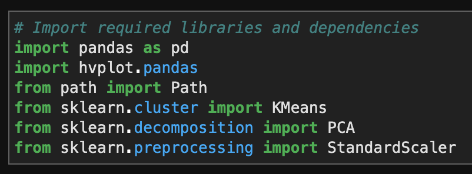
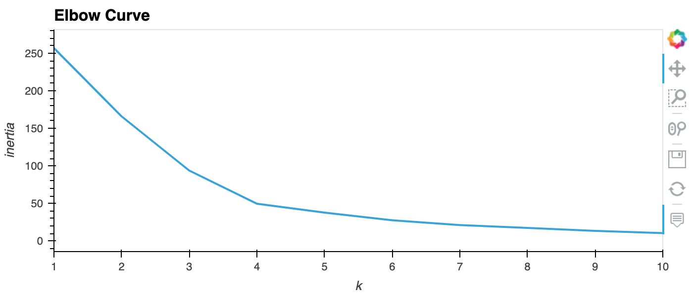
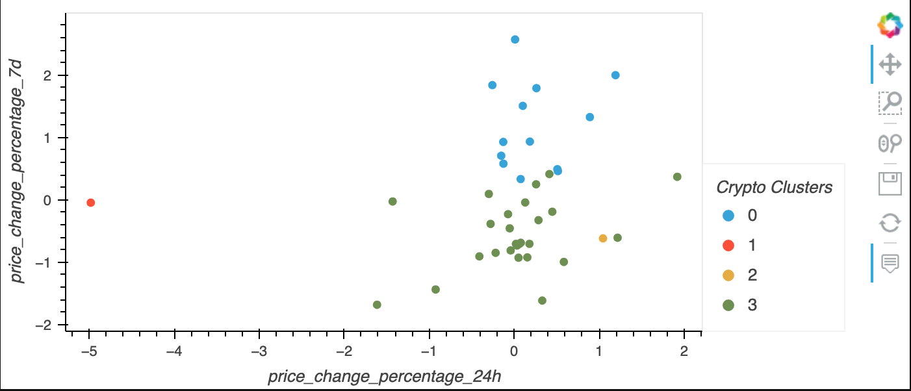
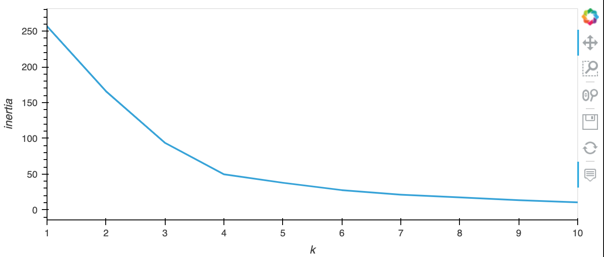
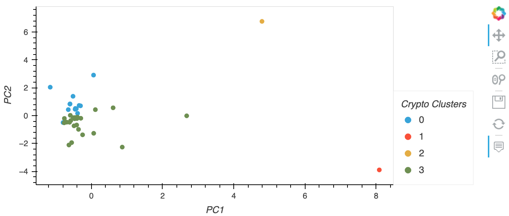

# Cryptocurrecies Performance Analysis (Unsupervised Learning)
>As machine learnings are widely used in analyzing and prediction cryptocurrency market, one can see the market performances in detail from another perspective. Unsupervised learning technique is used in this jupyter notebook to visualize cryptocurrencies performance in different time periods under different cluster methods.

Analysis includes:
    
* Finding the best k value using the original data

* Cluster Cryptocurrencies with K-means using the original data

* Optimize clusters with Principal Component Analysis (PCA)

* Find the best k value using PCA data

* Cluster Cryptocurrencies with K-means using the PCA data

* Visualize and compare results of two methods
---

## Technologies
This project leverages python 3.7 with the following packages:

* [pandas](https://pandas.pydata.org/docs/getting_started/overview.html) - To read, calculate, analysis, visualize data

* [scikit_learn](https://scikit-learn.org/stable/) - For predictive data analysis

* [hvplot](https://hvplot.holoviz.org/) - Provide interactive visualization
---

## Installation Guide

Before running the Jupyter notebook file, first, install the following dependencies in Terminal or Bash under the `dev` environment.

```python
  pip install pandas
  pip install -U scikit-learn
  pip install hvplot
```

---

## General Information
It is necessary to import all libraries and dependencies


-- Finding the best k value using the original data



-- Cluster Cryptocurrencies with K-means using the original data

```python
    df_market_data_predictions_plot =          df_market_data_predictions.hvplot.scatter(
    x='price_change_percentage_24h',
    y='price_change_percentage_7d',
    by='Crypto Clusters',
    hover_cols='coin_id'
)
df_market_data_predictions_plot
```



-- Optimize clusters with Principal Component Analysis (PCA)

```python
# Create a PCA model instance and set `n_components=3`.
pca = PCA(n_components=3)
# Use the PCA model with `fit_transform` to reduce to 
# three principal components.
crypto_pca_data = pca.fit_transform(df_market_data_scaled)
``` 

-- Find the best k value using PCA data



-- Cluster Cryptocurrencies with K-means using the PCA data

```python
crypto_pca_predictions_plot = crypto_pca_predictions.hvplot.scatter(
    x='PC1',
    y='PC2',
    by='Crypto Clusters',
    hover_cols='coin_id'
)
crypto_pca_predictions_plot
```




In conclusion, both methods generated the same k value, however the cluster visualization are different for each methods.Using fewer features to cluster the data gives less accurate clustering results. However, keeping many features can slow down the analyzing process. We want to find the right balance in between so we can have faster output with decent accuracy.

---

## Contributors

UC Berkeley Extension

Brought you by **Yanjun Lin Andrie**

* yanjun.lin.andrie@gmail.com

* https://www.linkedin.com/in/yanjun-linked

---

## License

MIT
